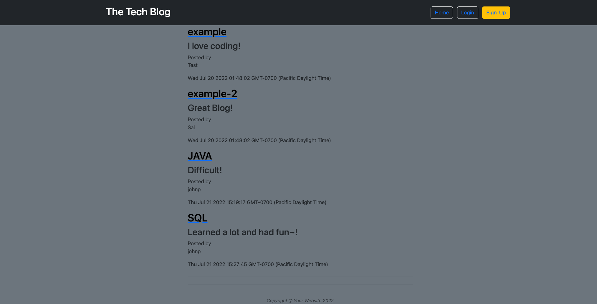

# tech-blog
***
## Description
For this assignment I had to build a CMS-style blog, where developers can publish their blog posts and comment on other developers' posts. The site includes a log in and sign up page where a user can input their information securely. Once a user logs in, they can read posts and comment on them. There is also a dashboard button which displays the logged in user's past post. 
***
## Table of Contents
- [Installation](#installation)
- [Usage](#usage)
- [Contributing](#contributing)
- [License](#license)
- [Test](#test)
- [Questions](#questions)
***
## Installation
No installation is required. 
***
## Usage
The site was lauched on Heroku. https://git.heroku.com/salty-temple-15964.git
***
## Contributing
N/A
***
## License

## Test
No test
***
## Questions
- https://github.com/armando1236/tech-blog.git
- For additional questions please email me at: amjr86@outlook.com

